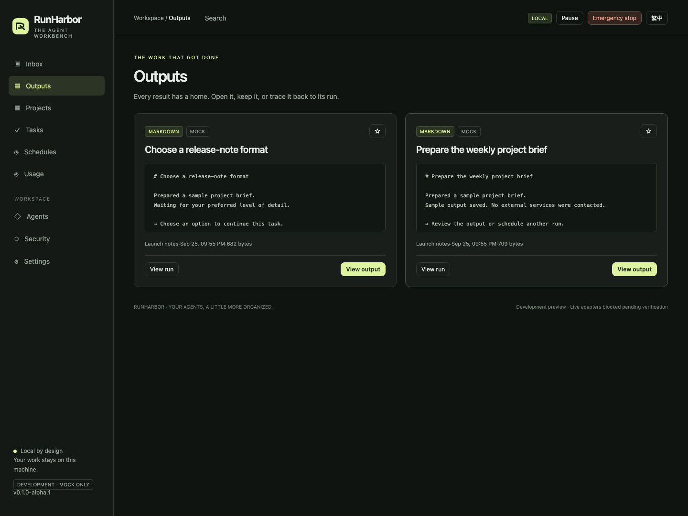

<p align="center"></p>

<h1 align="center">RunHarbor</h1>
<p align="center"><strong>Scheduled agents. Organized results. An inbox for what needs you.</strong></p>
<p align="center">A local workbench for recurring agent work — without another wall of chats.</p>
<p align="center"><a href="https://github.com/michaelmeicp/runharbor/actions/workflows/ci.yml"></a></p>
<p align="center"><a href="README.zh-Hant.md">繁體中文</a> · <a href="#try-it-locally">Quick start</a> · <a href="docs/implementation-status.md">Implementation status</a> · <a href="CONTRIBUTING.md">Contribute</a></p>

> **Safety and status:** This is a **mock-only development preview**, not the v1 product or a production agent runner. It binds to `127.0.0.1`, requires a password, and does not launch Codex or Claude, read provider credentials, or call a model. The [v1 security release gate](docs/release-gate.md) remains open. RunHarbor is independent of all model vendors; it does not provide, resell, or broker model access. Live subscription automation requires reviewing the provider's current terms before use.


## Why this exists

Recurring agent work should leave you with useful results, not hundreds of new conversations.

RunHarbor separates three things:

- **Work:** projects, tasks, and schedules describe what should happen.
- **Results:** runs, three-line summaries, and permanent outputs show what happened.
- **Decisions:** the inbox contains failures, questions, quota warnings, and pending delivery approvals.

The core scheduling invariant is tested: ten scheduled occurrences produce ten run records and **zero new tasks or threads**. A request for human input can explicitly escalate a run into a task.

## Try it locally

Requires **Node.js 24.13+** and npm. macOS/Linux; Windows via WSL is a target, not yet verified.

```sh
git clone https://github.com/michaelmeicp/runharbor.git
cd runharbor
npm ci --ignore-scripts
npm start
```

Open **http://127.0.0.1:4317**. Copy the one-time setup code from your terminal, choose a password of at least 12 characters, then select **Try the demo**.

The demo creates a sample project, a successful output, an input request, and a paused weekday schedule. It uses **no API keys, model tokens, or external services**. Every result is labeled Mock. The demo is scripted; it does not interpret your prompt as an AI model would.

Data is stored in `~/.runharbor` by default. Set `RUNHARBOR_DATA_DIR` or pass `--data-dir` to choose a different directory. No data is sent to a hosted service. npm downloads the pinned dependency during installation.

```sh
node src/cli.js start --port 4318 --data-dir ./data
node src/cli.js doctor
node src/cli.js stop-all
```

Use the same data directory for `stop-all` as the running service. After a hard crash, verify the old process is gone before removing a stale `service.lock`.

**No npm-registry package or container image has been published.** A downloadable npm-format archive and SHA-256 checksums are available in the [GitHub prerelease](https://github.com/michaelmeicp/runharbor/releases/tag/v0.1.0-alpha.1). Do not assume an unscoped `npx runharbor` package belongs to this project. The source checkout above is the current install path.

## What you can use today

| Workflow                      | Development build                                                                                                 |
| ----------------------------- | ----------------------------------------------------------------------------------------------------------------- |
| Project → task → run → output | Working with the scripted mock agent                                                                              |
| Exception inbox               | Deduplication, severity, snooze, dismiss, resolve, batch undo                                                     |
| Scheduled work                | Five-field cron, IANA timezones, next-five preview, bounded catch-up, retry, queue/skip/parallel policies         |
| Human input                   | Mock question, answer, continued task; schedule escalation                                                        |
| Outputs                       | Permanent Markdown files, inert preview, download, stars, workspace-independent retention                         |
| Memory                        | Human-authored project notes and bounded, taint-aware context injection                                           |
| Quota/fallback                | Synthetic quota scenarios, unknown values, policy preview foundations, new-run fallback with permission checks    |
| Local delivery                | Fixed folder, per-output hash-bound approval, idempotent filename                                                 |
| Safety controls               | Login, Host/Origin/CSRF checks, authenticated SSE, no HTML execution, redaction, audit hash chain, emergency stop |
| Search                        | SQLite FTS5 with short CJK substring fallback                                                                     |



## What is not ready

**Codex and Claude live execution are disabled.** Synthetic event parsers and proposed permission arguments are not proof of sandbox isolation.

Still open: the seven-day M0 alternative evaluation, verified live CLI fixtures and quota sources, OS sandbox probes, keyring/environment isolation, safe git worktrees and merges, RRULE, full failback/circuit behavior, encrypted backup/export, complete permanent deletion, plugin loading, complete localization, signed npm/container distribution, and the remaining v1 acceptance criteria.

The [implementation matrix](docs/implementation-status.md) tracks every functional and security requirement. The [M0 record](docs/M0-verification.md) separates local observations from unverified assumptions. **No compliance percentage or production readiness is implied by the passing test count.**

## A two-minute tour

1. Select **Try the demo** in the empty inbox.
2. Answer the input request. The next run stays in the same task.
3. Open **Outputs** and download the brief.
4. Open **Schedules**, inspect the next five triggers, and run a test. Enable it explicitly when ready.
5. In a project, enable mock fallback. In **Usage**, exhaust the primary mock quota, then run a task and inspect the new backup run.
6. Use **Emergency stop** to cancel work and pause dispatch. Resume explicitly.

Routine success stays in Outputs. Failure and questions return to the inbox.

## Development

```sh
npm ci --ignore-scripts
npm run verify
npx playwright install chromium
npm run test:browser
```

The unit/integration suite covers schedule identity, retry, catch-up, DST, inbox deduplication, context taint, fallback restrictions, content-bound delivery, emergency stop, path traversal, redaction, login, CSRF, and audit integrity. The browser suite exercises the demo, input continuation, output preview, scheduling, hostile text, and mobile layouts.

Only **one production dependency**: Croner. The server uses Node HTTP and SQLite; the browser uses native DOM APIs. See [architecture](docs/architecture.md) and the [draft adapter contract](packages/adapter-sdk/index.d.ts).

## Help shape the useful part

The next valuable contributions are evidence: sandbox probes, redacted **real** CLI fixtures, scheduler edge cases, accessibility fixes, and complete Traditional Chinese localization. See [CONTRIBUTING](CONTRIBUTING.md).

If this workflow would make your agent work easier to manage, a star helps others discover it. A reproducible issue or a focused pull request helps make it reliable.

## License and attribution

[Apache-2.0](LICENSE). This implementation does not copy Orca code. Third-party names describe planned interoperability and do not imply affiliation, endorsement, or shared licensing.
