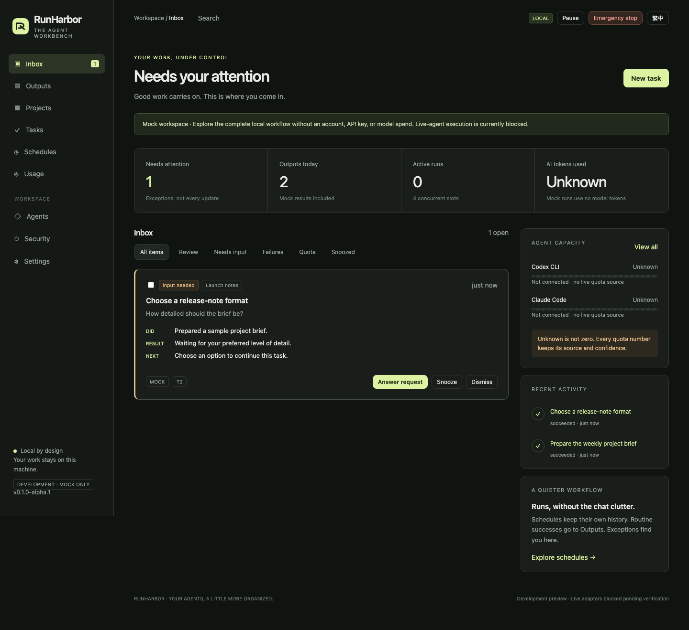

# RunHarbor

**排程代理、集中成果；收件匣只放需要你處理的事。**

[English](README.md) · [實作狀態](docs/implementation-status.md) · [v1 發佈閘門](docs/release-gate.md)

> **安全與狀態：目前是僅支援 Mock Agent 的開發預覽，尚未完成 v1。** 僅監聽 `127.0.0.1`，必須設定密碼。不會啟動 Codex／Claude、不讀取廠商憑證、不呼叫模型。真實代理須待 M0 相容性與沙箱測試通過後才可啟用。本專案不隸屬任何模型廠商，不提供、轉售或中介模型用量；訂閱自動化須先自行確認廠商現行條款。



## 為什麼做這個

每天、每週重複的代理工作，不應讓聊天清單越來越亂。

- **專案／任務／排程**管理要做的事。
- **Run／三行摘要／成果**保存每次做了什麼。
- **收件匣**集中失敗、問題、額度警示與待批准投遞。

自動化測試已驗證：10 次排程觸發產生 10 筆 Run，**不新增任務或 Thread**。需要你回答問題時，才明確升級成任務。

## 本機啟動

需要 **Node.js 24.13+** 與 npm。

```sh
git clone https://github.com/michaelmeicp/runharbor.git
cd runharbor
npm ci --ignore-scripts
npm start
```

開啟 **http://127.0.0.1:4317**，從終端複製一次性設定碼，設定至少 12 字元密碼，再按 **Try the demo**。

示範會建立專案、成功成果、待回答問題，以及一個暫停中的平日排程。**不需要 API key，不使用模型 token，不連接外部服務。** Mock 是固定劇本，不會像 AI 模型一樣理解你的 prompt。

資料預設保存在 `~/.runharbor`。可用 `RUNHARBOR_DATA_DIR` 或 `--data-dir` 指定位置。

```sh
node src/cli.js doctor
node src/cli.js stop-all
```

急停指令必須使用與服務相同的資料目錄。目前**未發佈 npm 套件或容器映像**，請用上述原始碼安裝方式；不要把其他同名套件當成本專案。

## 已可體驗

- 專案、任務、模擬執行、永久成果。
- 收件匣去重、延後、忽略、解決及批次復原。
- Cron、時區、未來五次預覽、重試、佇列與有限補跑。
- 結構化輸入請求，回答後繼續同一任務。
- 人工確認的專案記憶與污染追蹤。
- 模擬額度、來源標示與不提升權限的切換決策。
- 綁定內容雜湊的本機資料夾投遞批准。
- 登入、CSRF／Host／Origin 防護、稽核雜湊鏈、UI／CLI 急停。

介面可切換繁中導覽；**完整翻譯尚未完成**。未知用量一律顯示 Unknown／未知，不當作 0。

## 尚未完成

真實 Codex／Claude 執行、即時額度來源、macOS／Linux 沙箱驗證、金鑰庫、git worktree／審核合併、RRULE、完整切回與斷路器、加密備份與匯出、永久刪除、外掛載入、npm／Docker 簽章發佈等。

[狀態矩陣](docs/implementation-status.md) 保留所有需求編號；[M0 紀錄](docs/M0-verification.md) 區分已觀測與待驗證內容。測試通過不代表 19 項發佈安全基線已完成。

## 開發驗證

```sh
npm run verify
npx playwright install chromium
npm run test:browser
```

如果這個工作方式對你有用，歡迎 Star、回報可重現問題或提交小範圍 PR。授權：[Apache-2.0](LICENSE)。
