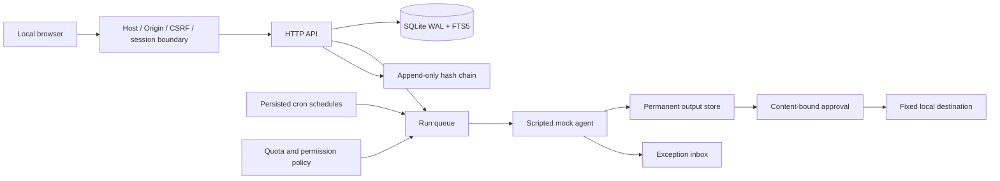

# Architecture

RunHarbor is a single-user local application. The development build deliberately executes only a deterministic in-process mock agent. It has no path that launches model-generated commands, reads provider credentials, performs git merges, or writes to an external service.

## Code map

| Module                  | Responsibility                                                                                    |
| ----------------------- | ------------------------------------------------------------------------------------------------- |
| `src/cli.js`            | Non-root launcher, single-service lock, doctor, stop sentinel                                     |
| `src/server.js`         | HTTP boundary, authentication, sessions, CSRF, authenticated SSE, API                             |
| `src/db.js`             | SQLite, transactional updates, FTS, redaction, event and audit persistence                        |
| `src/engine.js`         | Task and schedule lifecycle, queue, retry, quota deferral, mock supervision, artifacts, approvals |
| `src/policy.js`         | Tier validation, proposed CLI argv, fallback invariants, taint-aware context                      |
| `src/schedule.js`       | Cron and timezone validation, bounded catch-up, DST correction                                    |
| `src/adapters.js`       | Mock event generator, strict final-output parser, synthetic Codex/Claude event parsers            |
| `web/`                  | Dependency-free browser UI; all untrusted text uses DOM text nodes                                |
| `packages/adapter-sdk/` | Draft TypeScript adapter contract; dynamic plugin loading is not implemented                      |

## Important choices

- Node.js 24.13+ and its built-in SQLite module avoid an application build step and native addon installation. Node SQLite's stability level depends on the Node version; test the pinned supported runtime before release.
- Croner is the only production package. Its installed version is pinned in the lockfile.
- Jobs have an exclusive task-or-schedule owner. A scheduled occurrence may have multiple attempts, but retries retain the occurrence timestamp.
- Paused schedules do not create runs. Emergency stop cancels queued and active mock work, expires approvals, and disables fallback policies.
- Unknown quota and cost are `null`, never inferred as zero. Synthetic quota is explicitly `mock` confidence.
- Fallback chooses a new run and regenerates target argv from the source policy. Paid profiles and unapproved providers cannot be selected by the available UI.
- Output survives workspace cleanup. Local delivery binds approval to output hash, destination, and run ID.
- Audit logs record references, rather than copying project prompts into the audit chain.

## Boundaries still under development

This is not the complete v1 architecture. Real-agent sandboxing, credential brokering, safe git worktrees, code review, RRULE, encrypted backup/export, complete deletion, plugin loading, and release distribution remain open. The generic JSON entity store is intentionally an early implementation; full relational constraints and scalable pagination are required before claiming the specification's 50,000-run performance targets.

The browser uses an HttpOnly, SameSite=Strict cookie on loopback HTTP. A `__Host-` Secure cookie requires a validated HTTPS deployment strategy; it is an explicit release gap, not a fulfilled security requirement. Remote forwarding is rejected.

The hash chain detects altered rows, but cannot stop a process with full access to the data directory from replacing the whole database. Filesystem protections are defense in depth, not protection against a compromised owner account. Local-folder publication still needs adversarial concurrent-rename testing and stronger directory-handle binding before the full path-safety gate can pass.
